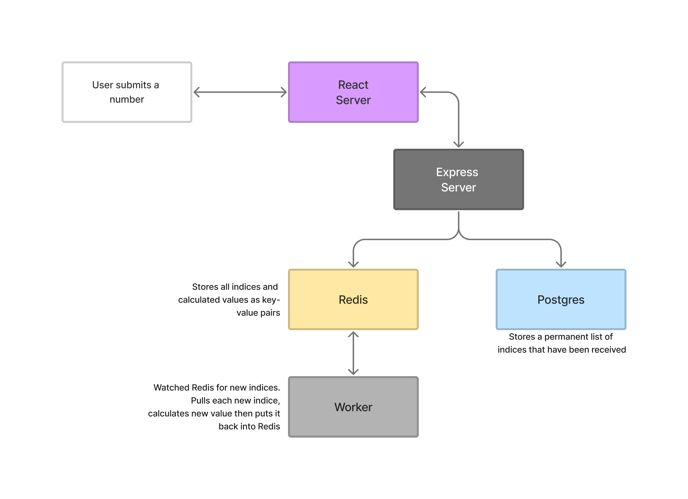

# Advanced Docker Infrastructure

* [Technologies](#technologies)
* [Overview](#overview)

### Technologies
* Docker
* React
* Nodejs
* Nginx
* Redis
* Postgres

### Overview

### Flow 

1. The user writes a number and clicks the submit button.
2. The React application makes an Ajax request to the backend Express server.
3. The Express server stores the number in the Postgres database. The Express server will also 
store the number in the Redis Cache Store. 
4. The Redis Cache Store will trigger a separate backend Nodejs process (worker).
5. The Worker watches Redis for new indices that show up. Anytime a new index shows up in Redis, 
the Worker is going to pull that value out and calculate the Fibonacci value for it and store the calculated
value back in Redis.
