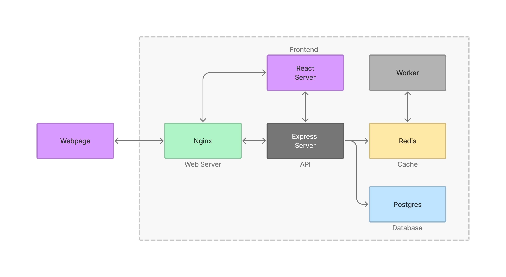
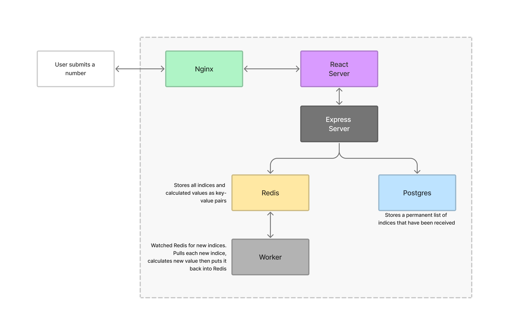
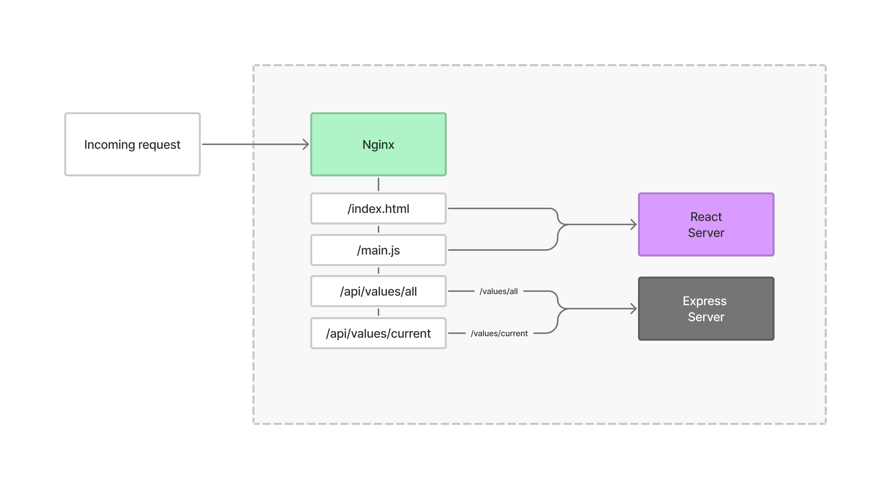
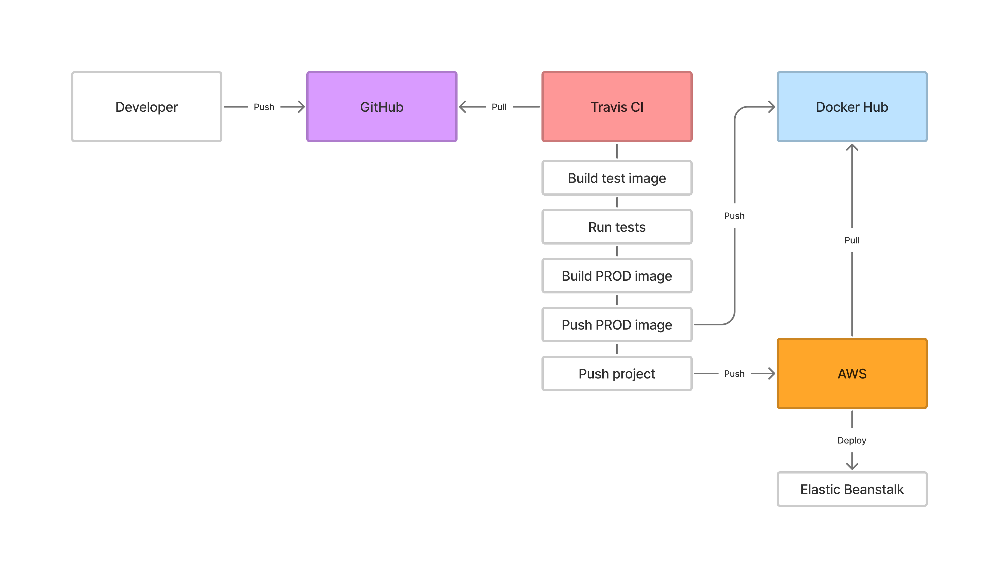
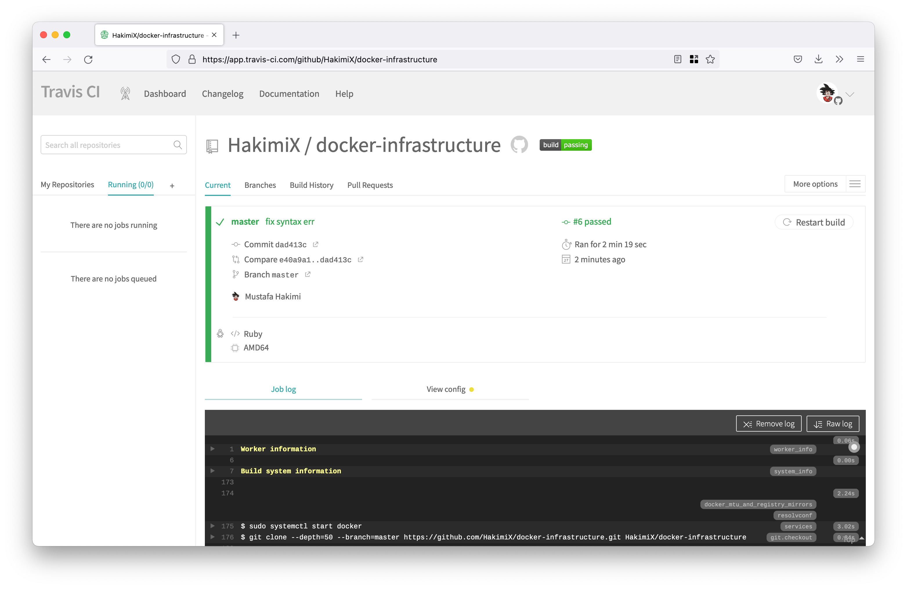
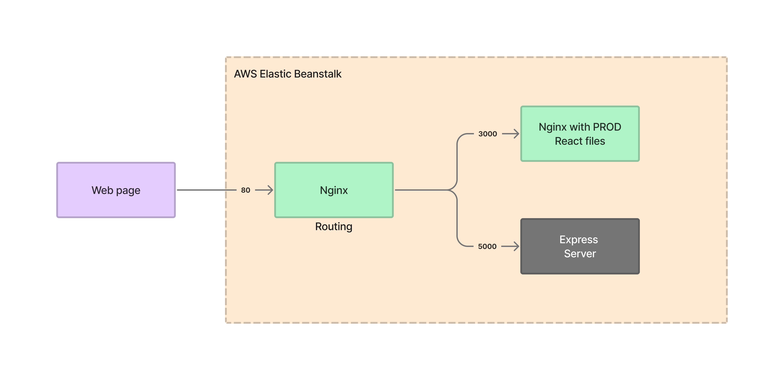
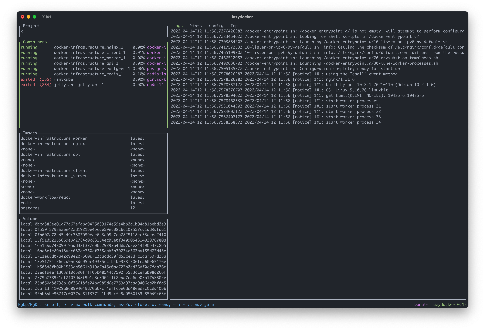
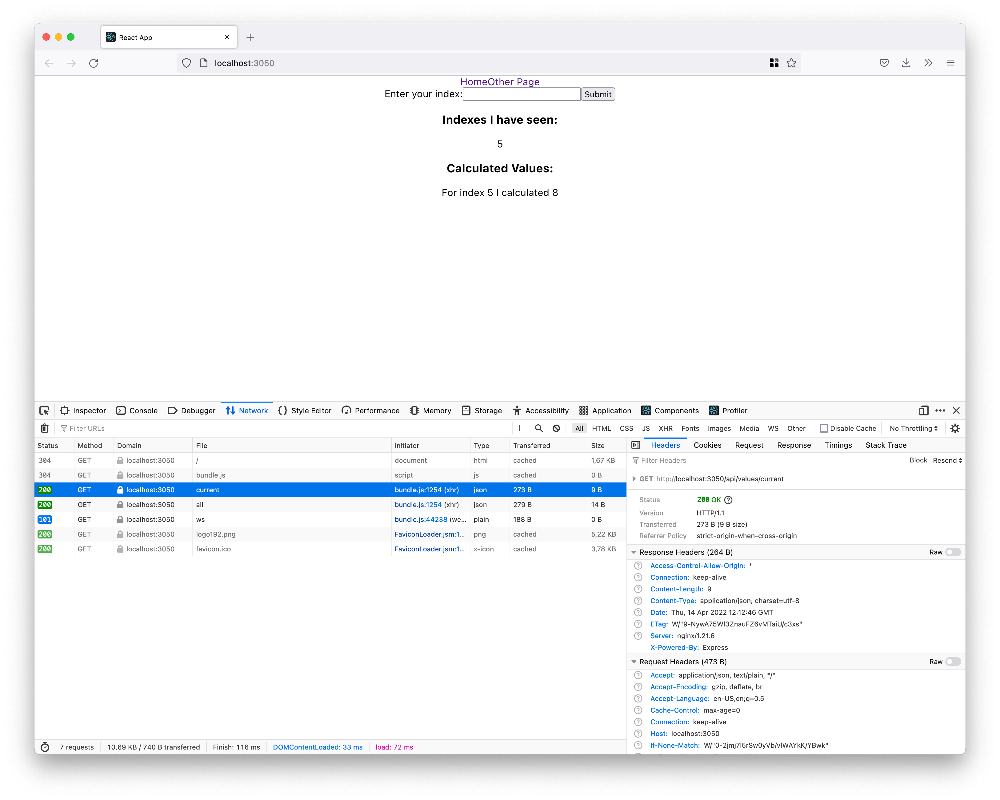
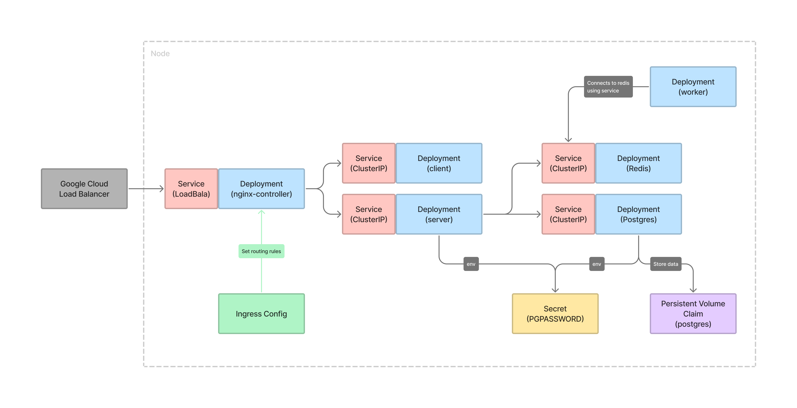
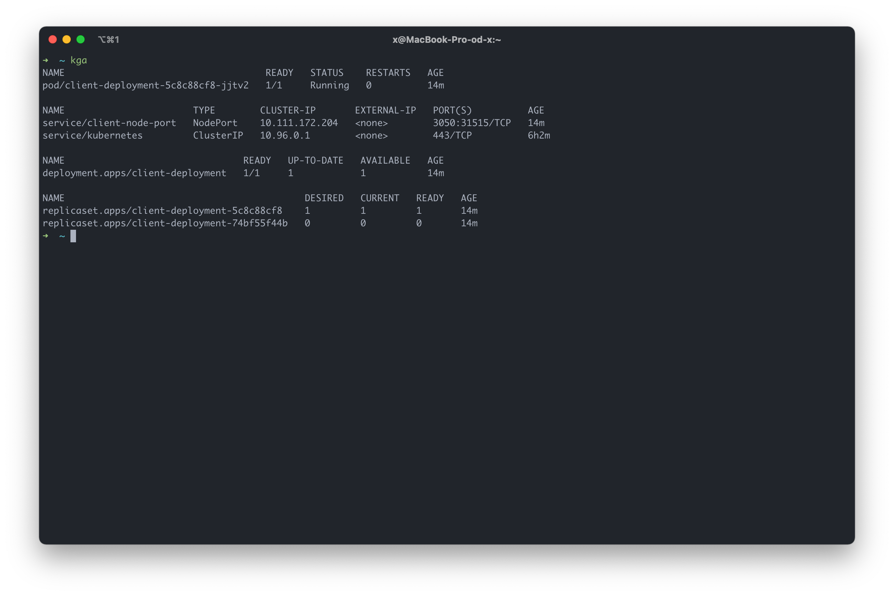

# Multi Container Infrastructure

This is an over the top complicated solution for calculating a Fibonacci number.
The purpose is to implement a multi container deployment.

* [Technologies](#technologies)
* [Overview](#overview)
* [Flow](#flow)
* [Nginx](#nginx)
* [Terraform](#terraform)
* [Travis CI](#travis-ci)
* [AWS Elastic Beanstalk](#aws-elastic-beanstalk)
* [Docker](#docker)
  * [Docker Compose](#docker-compose)
* [Kubernetes](#kubernetes)
  * [Local Developmet](#local-development)

### Technologies
* Docker
* React
* Nodejs
* Nginx
* Redis
* Postgres
* Terraform
* Travis CI
* AWS

### Overview


### Flow


1. The user writes a number and clicks the submit button.
2. The React application makes an Ajax request to the backend Express server.
3. The Express server stores the number in the Postgres database. The Express server will also
   store the number in the Redis Cache Store.
4. The Redis Cache Store will trigger a separate backend Nodejs process (worker).
5. The Worker watches Redis for new indices that show up. Anytime a new index shows up in Redis,
   the Worker is going to pull that value out and calculate the Fibonacci value for it and store the calculated
   value back in Redis.

### Nginx
The nginx server is going to look at the incomming requests and decide which
service to route the request to. The nginx routing is based on the url path:
* `/`: the request is routed to the React server.
* `/api`: the request is routed to the Express server.

The React server and Express server is "behind" the nginx server and cannot be accessed
unless you go through the nginx server (nginx refers to these as upstream servers).



### Terraform 
Terraform allows us to manage infrastructure as code (IaC) rather tham using a graphical
user interface. It allows us to manage the infrastructure in a safe, consistent and 
repeatable way by defining resource configurations that we can version and reuse.
```shell
# Initialize the working directory so Terraform can run the configuration
terraform init

# Validate the configurations
terraform validate

# Preview any changes before you apply them 
terraform plan 

# Execute the changes (create, update or destroy resources)
terraform apply
```
work in progress...

## Travis CI 
1. Push code to GitHub.
2. Travis CI
   * Automatically pull the repository. 
   * Builds a test image and runs tests. 
   * Builds PROD images. 
   * Pushes PROD images to Docker Hub. 
   * Pushes project to AWS Elastic Beanstalk (EB) 
3. AWS EB pull images from Docker Hub and Deploys. 



Travis CI will automatically pull the repository and run the CI/CD pipeline whenver code is merged to master. 


### AWS Elastic Beanstalk


### Docker 
#### Docker Compose
Start the containers 
```shell
docker-compose up
```



Building and pushing images locally
```shell
# Build image 
docker build -t hakimixx/docker-infra-client:v1 client

# Push image
docker push hakimixx/docker-infra-client:v1
```

### Kubernetes

#### Overview


#### Deployment 
AWS EKS

#### Local Development
Local development using Minikube or Docker Desktop 
```shell
# Change context (or minikube)
kubectx docker-desktop

# Apply kubernetes resources
kubectl apply -f kubernetes

# Verify that the resouces are created successfully
kubectl get all

# Navigate to the nodePort (defined in the service)
http://localhost:31515

# For minikube you have to get the minikube ip first
minikube ip 

# Navigate to the nodePort
http://194.148.19.2:31515
```



Updating deployment image: 
```shell
# Command 
kubectl set image <object-type>/<object-name> <container-name>=<new image to use>

# Example
kubectl set image deployment/client-deployment client=hakimixx/docker-infra-client:v1
```
