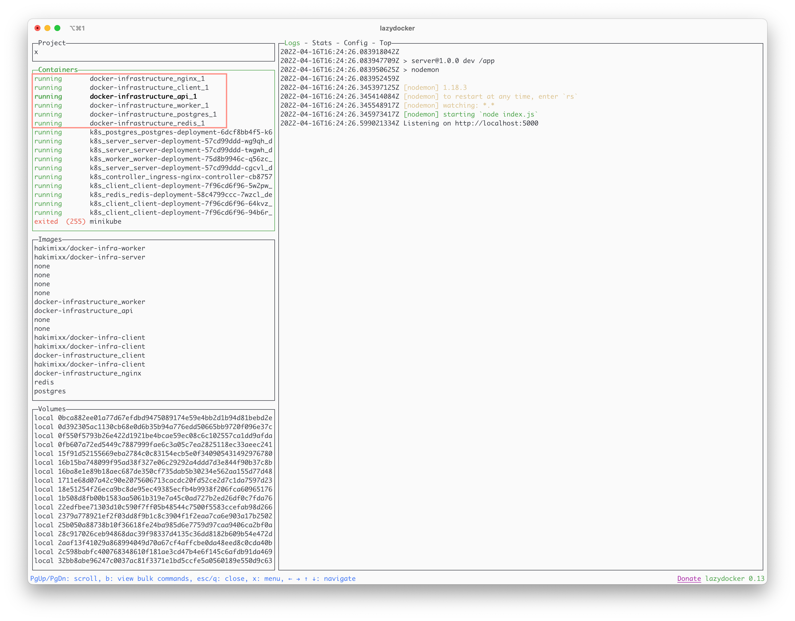
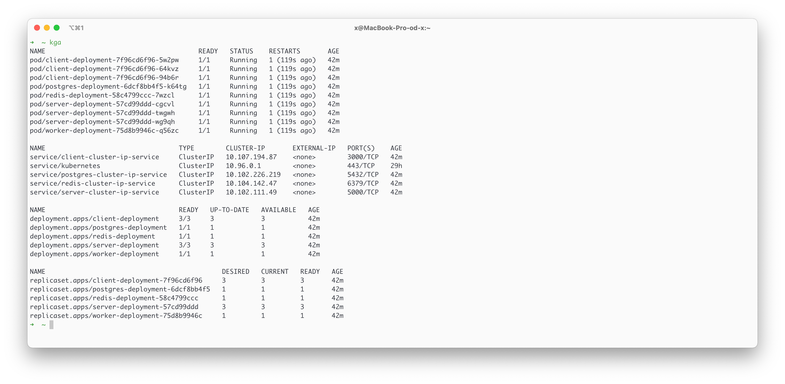
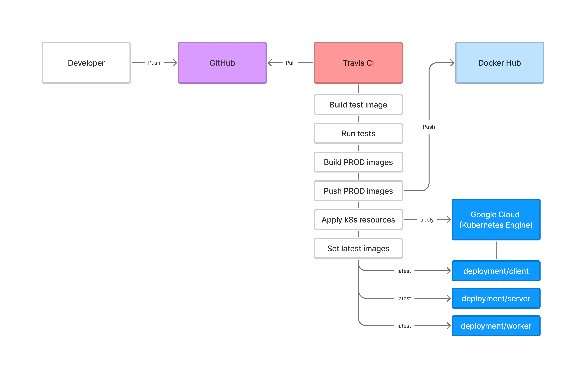
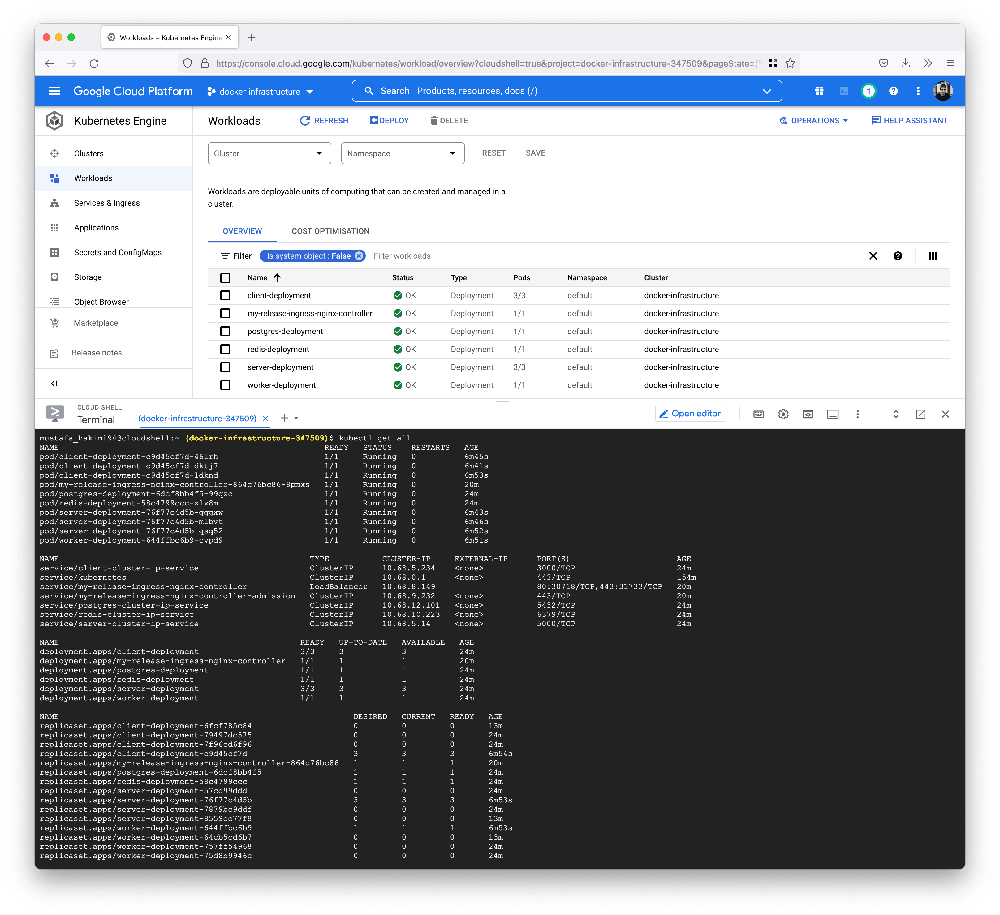
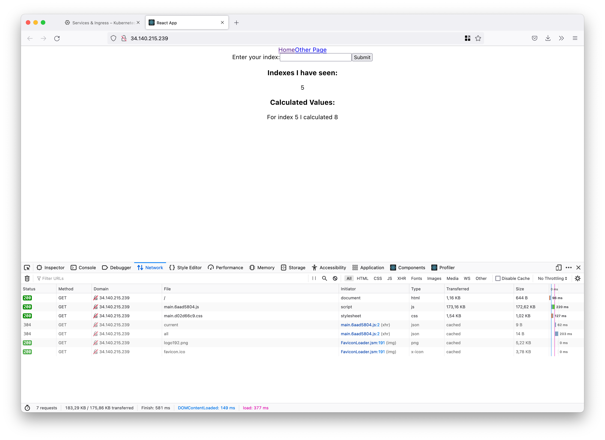
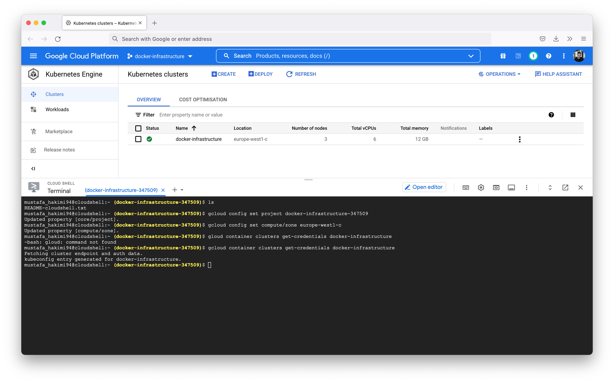

# Multi Container Infrastructure

This is an over the top complicated solution for calculating a Fibonacci number.
The purpose is to implement a multi container deployment.

Two different solutions have been implemented for local development and deploying 
the application:
1. Using Docker and AWS Elastic Beanstalk.
   _(docker-compose for local development)_
2. Using Kubernetes and Google Cloud.
   _(minikube or docker-desktop for local development)_

**Technologies**: Docker, React, Node.js, Nginx, Redis, Postgres, Terraform, Travis CI, Kubernetes
Helm, AWS, Google Cloud. 

* [Application](#application)
  * [Overview](#overview)
  * [Flow](#flow)
* [Docker and AWS Elatic Beanstalk](#docker-and-aws-elatic-beanstalk)
  * [Nginx](#nginx)
  * [Local Developemt](#local-development-using-docker-compose)
  * [Terraform](#terraform)
  * [Travis CI](#travis-ci)
  * [Deploying to AWS Elastic Beanstalk](#deploying-to-aws-elastic-beanstalk)
* [Kubernetes and Google Cloud](#kubernetes-and-google-cloud)
  * [Ingress-Nginx on Google Cloud](#ingress-nginx-on-google-cloud)
  * [Local Development using Docker Desktop](#local-development-using-docker-desktop)
  * [Deploying to Google Cloud](#deploying-to-google-cloud)

## Application
### Overview


### Flow


1. The user writes a number and clicks the submit button.
2. The React application makes an Ajax request to the backend Express server.
3. The Express server stores the number in the Postgres database. The Express server will also
   store the number in the Redis Cache Store.
4. The Redis Cache Store will trigger a separate backend Nodejs process (worker).
5. The Worker watches Redis for new indices that show up. Anytime a new index shows up in Redis,
   the Worker is going to pull that value out and calculate the Fibonacci value for it and store the calculated
   value back in Redis.

## Docker and AWS Elastic Beanstalk

### Nginx
The nginx server is going to look at the incomming requests and decide which
service to route the request to. The nginx routing is based on the url path:
* `/`: the request is routed to the React server.
* `/api`: the request is routed to the Express server.

The React server and Express server is "behind" the nginx server and cannot be accessed
unless you go through the nginx server (nginx refers to these as upstream servers).


### Local Development using Docker Compose
Start the containers
```shell
docker-compose up
```




Building and pushing images locally
```shell
# Build image 
docker build -t hakimixx/docker-infra-client:v1 client

# Push image
docker push hakimixx/docker-infra-client:v1
```

### Terraform 
Terraform allows us to manage infrastructure as code (IaC) rather than using a graphical
user interface. It allows us to manage the infrastructure in a safe, consistent and 
repeatable way by defining resource configurations that we can version and reuse.
```shell
# Initialize the working directory so Terraform can run the configuration
terraform init

# Validate the configurations
terraform validate

# Preview any changes before you apply them 
terraform plan 

# Execute the changes (create, update or destroy resources)
terraform apply
```
_work in progress..._

### Travis CI 
1. Push code to GitHub.
2. Travis CI
   * Automatically pull the repository. 
   * Builds a test image and runs tests. 
   * Builds PROD images. 
   * Pushes PROD images to Docker Hub. 
   * Pushes project to AWS Elastic Beanstalk (EB) 
3. AWS EB pull images from Docker Hub and Deploys. 


Travis CI will automatically pull the repository and runs the CI/CD pipeline whenver code is merged to master. 


Travis CI for the Docker and AWS Elastic Beanstalk solution is currently disabled:
```shell
disabled.travis.yml

# remove 'disabled' to enable 
.travis.yml 
```

### Deploying to AWS Elastic Beanstalk
AWS Elastic Beanstalk is chosen because it is the fastest and simplest way to deploy an application on AWS.
Elastic Beanstalk provisions and operates the infrastructure and manages the application for you.


## Kubernetes and Google Cloud

### Ingress-Nginx on Google Cloud


### Local Development using Docker Desktop
```shell
# Change context 
kubectx docker-desktop

# Apply kubernetes resources 
./scripts/apply-resources-sh

# Create secrets (specify a better password)
kubectl create secret generic pgpassword --from-literal PGPASSWORD=postgres 

# Verify that the resources are created successfully
kubectl get all

# Navigate to the client (ingress-nginx listens on port 80) 
http://localhost:80

# Deleting resources
./scripts/delete-resources.sh
```


Updating deployment image: 
```shell
# Command 
kubectl set image <object-type>/<object-name> <container-name>=<new image to use>

# Example
kubectl set image deployment/client-deployment client=hakimixx/docker-infra-client:v1
```

Creating secrets (base64 encoded):
```shell
# Command
kubectl create secret <type> <secret-name> --from-literal <key-value-pair>

# Example 
kubectl create secret generic pgpassword --from-literal PGPASSWORD=postgres

# Decode secret
echo <secret-value> | base64 --decode
```

### Deploying to Google Cloud
The infrastructure (kubernetes configuration) is currenlty set up manually through the 
Google Cloud Console. _(should be implemented with Terraform)_

#### Google Cloud Service Account
The Google Cloud Service Account credentials (JSON file) are encrypted and uploaded to the 
Travis CI account using Travis CI CLI. 
```shell
# Ruby is required to install Travis CI CLI
gem install travis

# Login to Travis CI (requires a Github token)
travis login --github-token <github-token> --com

$ "Successfully logged in as HakimiX!"

# Encrypt the service-account.json file 
travis encrypt-file service-account.json -r hakimix/docker-infrastructure --com

$ "encrypting service-account.json for Hakimix/docker-infrastructure"
$ "storing result as service-account.json.enc"
$ "storing secure env variables for decryption"
```
Alternative way of installing Travis CI CLI using a Docker image:
```shell
# Navigate to project directory (or dir that contains the service-account JSON file)
cd docker-infrastructure 

# Run a docker image with a volume (project dir) and ruby installed
docker run -it -v $(pwd):/app ruby:2.4 sh

# Install Travis CI CLI using gem
gem install travis

# Copy the service-account.json file into the project dir, which will automatically 
# be mounted into the /app dir inside the container 
```

#### Travis CI (Google Cloud)
Configuration: 
1. Install Google Cloud SDK CLI.
2. Configure the SDK with the Google Cloud auth information.
3. Login to Docker CLI.
4. Build the "test" version of application (client, server, worker).
5. Run tests. 
6. Deploy the newest images. 
7. Build all images, tag, and push to Docker Hub. 
8. Apply all the Kubernetes resources. 
9. Imperatively set the latest images on each deployment.

:warning: Secrets are created manually in the Google Cloud Shell.




Navigate to the ingress-nginx-controller IP (external load balancer) to see the 
deployed application in action
 

### Configure Google Cloud Shell
The Google Cloud Shell needs the following configurations (same as travis `before_install` steps):
```shell
gcloud config set project docker-infrastructure-347509 # set project ID
$ "Updated property [core/project]"

gcloud config set compute/zone europe-west1-c # set region
$ "Updated property [compute/zone]"

gcloud container clusters get-credentials docker-infrastructure # set cluster name
$ "Fetching cluster endpoint and auth data."
$ "kubeconfig entry generated for docker-infrastructure."
```


Create the secrets inside the Google Cloud Shell
```shell
kubectl create secret generic pgpassword --from-literal PGPASSWORD=postgres
```

#### Install Helm v3
Helm helps you manage kubernetes packages. Helm charts help you define, install, and 
upgrade kubernetes applications. 

In the Google Cloud Shell run the following:
```shell
curl -fsSL -o get_helm.sh https://raw.githubusercontent.com/helm/helm/master/scripts/get-helm-3
chmod 700 get_helm.sh
./get_helm.sh

$ "Preparing to install helm into /usr/local/bin"
$ "helm installed into /usr/local/bin/helm"
```

#### Install Ingress-Nginx
The Nginx Ingress controller can be installed via Helm using the chart "stable/nginx-ingress" 
from the official charts repository.

In the Google Cloud Shell run the following:
```shell
helm repo add ingress-nginx https://kubernetes.github.io/ingress-nginx
$ "ingress-nginx has been added to your repositories"

helm install my-release ingress-nginx/ingress-nginx
$ "The ingress-nginx controller has been installed."
```

## Sources

* [Google Cloud Free Tier](https://cloud.google.com/free)
* [GitHub Token](https://docs.github.com/en/authentication/keeping-your-account-and-data-secure/creating-a-personal-access-token)
